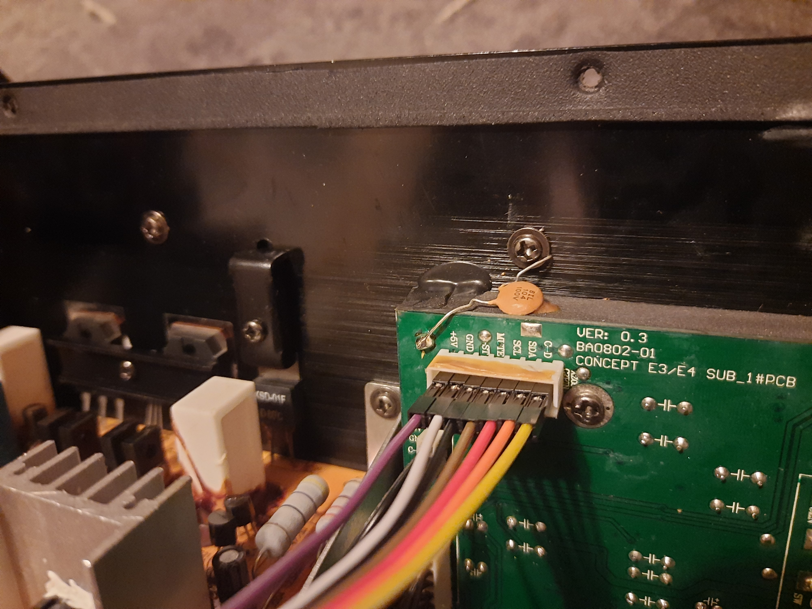

# Anschluss Display Board
Das Display Board auf welchem sich die Regler für die Lautstärke und den Bass, als auch der Knopf für den Standby befinden ist über einen 7-Pin JST-HX Stecker mit dem Mainboard verbunden. Genau diesen Anschluss verwende ich, um meinen Subwoofer über HomeAssistant zu steuern.

| Label        | Bedeutung                     | high       | low           |
| ------------ | ----------------------------- | ---------- | ------------- |
| +5V          |                               |            |               |
| GND          |                               |            |               |
| ST           | Standby                       | Sleep      | Work          |
| MUTE/Control |                               | AMP an     | AMP aus       |
| SCL          |                               |            |               |
| SDA          |                               |            |               |
| C-D          | Vielleicht Channel Disconnect | kein Audio | Audio erkannt |

## ST-Pin
Der ST-Pin ist für das Schalten des Standby Relais. Dieses unterbricht die Spannungsversorgung zum großen Trafo am Boden des Subwoofers. Wenn ST auf `HIGH` ist schaltet das Relais nicht durch. Wenn ST auf `LOW` ist schaltet das Relais durch und die beiden Amps werden über den großen Trafo mit Spannung versorgt.

Da ST am Standby Netzteil mit der Basis eines 2N5401 PNP Transistors verbunden ist, welcher dann wiederum über einen 2N5551 NPN Transistor das Relais schält muss ST zuverlässig auf GND geschaltet werden, um das Relais zu steuern.

Es reicht nicht ST direkt an einen ESP32 zu hängen und den GPIO-PIN auf `LOW` zu setzen. Dementsprechend funktionieren auch simple I2C Logic Level Shifter nicht, da diese Pull Up Widerstände haben.

## MUTE / Control
Nach dem ST auf `LOW` geschaltet wurde, muss der MUTE Pin auf `HIGH` geschaltet werden. Das Display Board von Teufel wartet hier erst noch ca. 3 Sekunden bevor der Pin auf 5V geschaltet wird. Das Signal wird vom Mainboard glaub ich einfach an die beiden Amps durchgereicht. Beim Amp des Subwoofers wird MUTE als Control bezeichnet.

Wenn MUTE über einen GPIO Pin eines ESP32 auf 3,3V geschaltet wird, schält das Relais des Subwoofer Amps und schält ihn frei. Der AMP der Satelliten Lautsprecher ist jedoch unbrauchbar leise. Dies ist auch der Fall, wenn MUTE über einen 10k Ohm Pull Up auf 5V geschaltet wird.

MUTE wird nur korrekt als `HIGH` erkannt, wenn er über einen 1k Ohm Pull Up oder direkt mit 5V verbunden wird. Siehe Issue `#3`.

Mit meinem Multimeter habe ich versucht den Stromfluss auf MUTE bei `HIGH` zu messen, der Strom war jedoch zu gering für mein Messgerät.

## SCL und SDA
SCL und SDA werden für die Übertragung der Lautstärke über das I2C Protokoll verwendet. Siehe: [Protokoll](Protokoll.md)

## C-D
Ich weiß nicht genau wofür `C-D` steht. Aber es scheint vom Display Board mit wahrscheinlich 10k Ohm auf 5V hochgezogen zu werden. Wenn aber das Display Board getrennt wird, dann liegen an `C-D` entweder 5V oder 0V an, je nach dem, ob gerade Musik abgespielt wird. Es wird dabei jedoch nur Audio beachtet, dass über die beiden vorderen Lautsprecher (FR und FL) abgespielt werden soll. 
