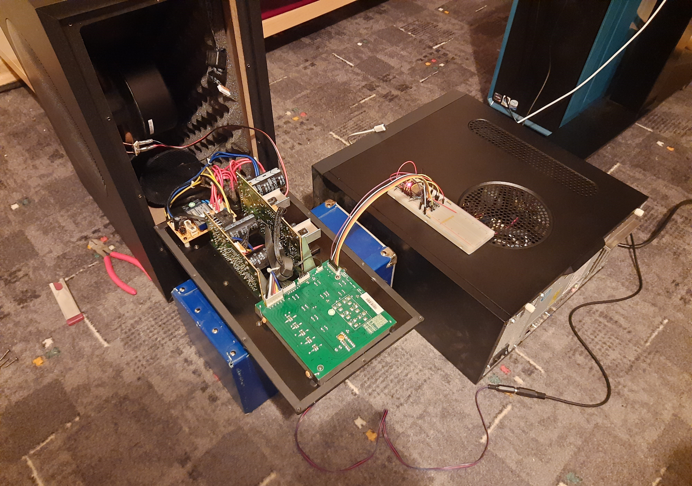

# Teufel Concept E300 Reverse Engineering

Dieses Repository enthält alle Dateien von meinem Reverse Engineering Projekt meines 5.1 Surround Sound Systems.
Beim System handelt es sich um einen Concept E3 der Marke Teufel.
Die Erkenntnisse aus diesem Projekt können jedoch sehr wahrscheinlich auf andere Systeme der Marke Teufel übertragen werden, solange sie aus einer ähnlichen Zeit stammen (ca. 2010).

## Warnung!
Das Testen und Sammeln von Informationen erforderte das Arbeiten am Subwoofer während er mit Netzspannung versorgt wurde. Sowohl die 230V Wechselspannung als auch die 50V Gleichspannung am Amplifier können potentiell tödlich sein. Wenn du nicht weist, was du tust und keine Erfahrung mit Elektronik hast, dann solltest du nicht mit solchen Spannungen arbeiten. Ich bin nicht verantwortlich solltest du dich bei einem ähnlichen Projekt oder dergleichen verletzen.

## For English speaking people
This repository contains all files for a hobby project of mine where I reverse engineered a 5.1 surround sound system manufactured by the German company Teufel. Since I am German and I don't think my system was sold outside of Germany I wrote all the documentation in German too. If my assumption was wrong or you're just interested in the project it's self, you can open an issue and request a translation... or just use a translator.

## Caution!
This project involved working on the subwoofer while it was connected to mains voltage and the components exposed. If you don't know what you are doing you should not do a project like this. I am not responsible if you hurt yourself or anything like that because you did know what you were doing.

## Hinweis
Dieses Projekt ist noch nicht abgeschlossen und unfertig.

## Motivation
Ich hab mich schon immer für Elektronik und deren Zusammenspiel mit Informatik interessiert. Dementsprechend hatte ich schon immer bei jedem Gerät das Interesse es zu zerlegen und herauszufinden wie es funktioniert.
Der Vorbesitzer meines Systems verkaufte mir damals das System, da es ihn störte jedes mal an den Subwoofer hin laufen zu müssen, um in aus dem Standby zu wecken. In Foren fand ich weitere Personen die es stört, dass das System jedes mal in den Standby zurückkehrt, wenn man die Stromversorgung unterbricht.
Da ich gefühlt jedes Gerät zu irgendeinem Zeitpunkt zerlege, war auch mein Subwoofer keine Ausnahme. Beim Zerlegen und Bewundern der Platine sprang mir eine Sache direkt ins Auge. Die Leitungen, die von der Gehäusefront mit dem Standbyknopf und den Lautstärkereglern zurück zum Mainboard führten, waren die Beschriftungen `SDA` und `SCL` aufgedruckt. Diese deuteten auf einen I2C Bus hin. Da Sowohl der Atmel Atmega328p (Arduino nano) als auch der ESP32 einen bzw. zwei I2C Busse haben entstand die Idee meinen Subwoofer Smart zu machen, sprich ihn nicht nur per WLAN wecken, sondern auch die Lautstärke einstellen zu können.
2024 entstand dann während meiner Semesterferien dieses Projekt aus der ursprünglichen Idee.

## Setup
Falls irgendjemand ebenfalls noch ein altes System der Firma Teufel hat und es auch in Home Assistant integrieren will habe ich ein paar Hilfestellungen dafür aufgeschrieben. Siehe: [Setup](Docs/Setup/README.md)

## Dokumentation meines Systems
Ich habe versucht alle meine Erkenntnisse über mein System in ein paar Markdown Dokumenten zusammenzufassen. Siehe: [Concept E3](Docs/Concept_E300/README.md)

## Reverse Engineering
Für die Leute, die sich vielleicht überlegen ein ähnliches Projekt durchzuführen oder einfach nur interessiert sind, wie ich dabei vorgegangen bin, habe ich ein bisschen Prosa verfasst. Siehe hier: [Reverse Engineering](Docs/Reverse_Engineering/README.md)
